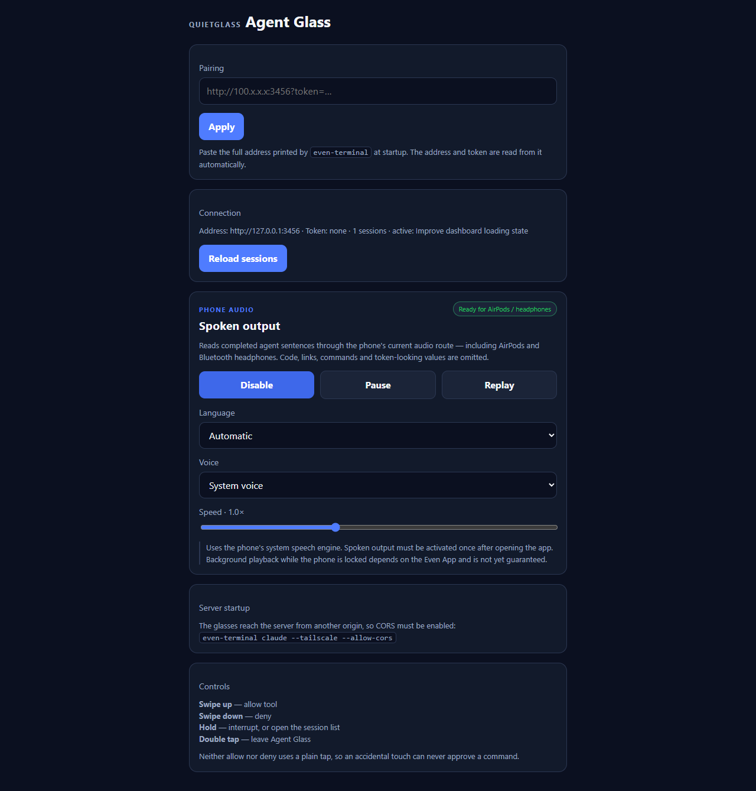

# Agent Glass

**Quietglass** · Watch and steer a coding agent without returning to your desk.

Agent Glass connects the Even G2 to Even Terminal, the existing Hermes
EvenHub bridge, or the existing OpenClaw gateway. It streams the active agent
to the glasses and, where the backend exposes real permission events, surfaces
those decisions for a deliberate answer.

It can also read completed agent sentences through the phone's current audio
route, including AirPods and Bluetooth headphones. Spoken output is opt-in and
must be activated once from the phone after opening the app.


*Captured at the real 576 × 288 simulator resolution using the private,
offline `?demo=1` mode. No live terminal session or personal data is shown.*

## What it shows

The normal working view keeps only the newest part of the agent response and
the currently running tool:

```text
Improve dashboard loading state

I am updating the loading state and
checking the component tests.

> Edit

working · 12 s · hold = interrupt
```

When the agent requests permission, that decision takes over the display:

```text
Permission required

Bash

npm run build

up = allow · down = deny
```

Neither answer uses a plain tap, so an accidental touch cannot approve a
command.

## Important limitations

Even Terminal can read existing Claude Code sessions from disk, but it can
only control sessions that it started itself. Agent Glass checks this for each
session and labels external sessions as `watch only`; it never offers controls
that would silently fail.

Free-text questions must still be answered on the computer. Binary permission
requests can be allowed or denied from the glasses.

Hermes and OpenClaw do not currently expose that same external permission
decision contract. Hermes supports prompts, replies, history, tool activity,
new sessions and interruption through its WebSocket bridge. OpenClaw supports
prompts, replies, in-app conversation context and request interruption through
its proven OpenAI-compatible endpoint. Neither displays a misleading
allow/deny control.

## Controls

| Gesture | Action |
|---|---|
| **Swipe up** | Allow a tool request in a controllable session |
| **Swipe down** | Deny a tool request |
| **Hold** | Interrupt a running agent, otherwise open the session list |
| **Swipe** in session list | Select a session |
| **Tap** | Open a session, retry after an error, or replay the last spoken answer |
| **Double tap** | Exit Agent Glass |

## Spoken output



Enable **Spoken output** in the phone view, then choose a language, one of the
voices installed on the phone, and a speed. Agent Glass waits for completed
sentences instead of reading streaming tokens one by one.

For privacy and clarity, it does not read code blocks, inline code, URLs,
permission commands, or values that look like access tokens. A permission
request is spoken only as “Permission required — check the glasses”; the
actual command stays visual.

The same implementation runs in the Even App on iOS and Android. iOS uses a
WKWebView and Android uses Chromium. Both route speech through the phone's
selected audio output. Reliable playback after locking or backgrounding the
phone still requires a native audio-output API from the Even App and is not
promised by this version.

## Supported agents

| Agent | Current support | Detail |
|---|---|---|
| **Claude Code** | Yes | Sessions, streaming text and permission decisions through Even Terminal |
| **Codex** | Yes | Sessions, streaming text and permission decisions through Even Terminal |
| **Hermes** | Yes | Existing `hermes-evenhub-bridge`: sessions, history, streamed replies, tools, new sessions and interruption |
| **OpenClaw** | Yes | Existing gateway: health check, conversation context, replies and local request interruption |

During the review, [cc-g2](https://github.com/wmoto-ai/cc-g2) was identified as
the earlier agent app. It implements hook-based Claude Code, Codex CLI and
Copilot CLI flows. Agent Glass keeps Even Terminal for those coding sessions
and now adds the existing Hermes and OpenClaw gateway protocols alongside it.

## Setup

Choose the backend in the phone view, enter its address and token, then tap
**Save and connect**. The phone view also contains a prompt composer. When a
backend has only one session, Agent Glass opens it automatically.

### Claude Code or Codex — Even Terminal

Start Even Terminal with CORS enabled. Keep it on a private network such as
Tailscale or your local LAN.

```bash
even-terminal start --tailscale --allow-cors
```

Paste the full pairing address printed by Even Terminal into the Agent Glass
phone view. The app extracts the server address and token automatically.

`even-terminal claude` is a client, not the server. All HTTP endpoints live
under `/api`, and `--allow-cors` is required because the app and terminal use
different origins.

### Hermes — existing EvenHub bridge

Use the WebSocket bridge already present in the G2 agent setup:

```text
wss://<node>.<tailnet>.ts.net:8443
EVENHUB_BRIDGE_TOKEN
```

Agent Glass uses the bridge's existing `hello`, `sessions.*`, `history`,
`assistant.*`, `tool.*`, `text` and `stop` messages. No new Hermes gateway is
required. A local development address such as `ws://127.0.0.1:8765` only works
when it is reachable from the phone; Tailscale Serve is recommended for a real
device.

### OpenClaw — existing gateway

Use the existing OpenClaw gateway root and token, normally:

```text
http://<reachable-host>:18789
```

The gateway must have `gateway.http.endpoints.chatCompletions.enabled=true`.
Agent Glass checks `/healthz` and sends the same proven request used by the
existing local G2 assistant to `/v1/chat/completions` with model `openclaw`.
The configured OpenClaw agent continues to choose its own primary model and
fallbacks.

## Develop and test

```bash
npm install
npm run dev
npm test
npm run build
npm run pack
```

Open `http://127.0.0.1:5202/?demo=1` for an isolated, in-memory demo. Demo
mode does not read stored sessions, connect to Even Terminal, or expose a
token. Use this mode for screenshots and documentation.

For a development-only live connection, a pairing URL may be passed as a
URL-encoded `pair` parameter. Never use that form in screenshots or public
documentation because URLs can be recorded by browser and proxy logs.

## Privacy and security

The Even Terminal token is a powerful credential. Agent Glass never logs it,
never displays it in full, and never renders it on the glasses. A `?token=`
pasted as part of any address is moved into the token field instead of being
kept in the address. Do not expose Even Terminal through a public tunnel
unless you understand and accept the risk.

One exception is unavoidable: the browser's `EventSource` cannot send an
`Authorization` header, so the Even Terminal live stream carries the token in
its query string. That URL is built inside the WebView and is never logged or
shown, but a proxy in front of Even Terminal may log it.

A swipe only answers the permission request that is on the display: it is
ignored for the first moment after a request appears, while an answer is still
being sent, while an error screen covers the request, and for a request that a
reconnecting stream delivers again after it was answered.

### Network whitelist

`app.json` allows `http://*`, `https://*`, `ws://*` and `wss://*`. This is
deliberately broad: the Even Hub whitelist is a fixed list of URL patterns
packed into the app, while the gateway address is entered by the user at run
time and differs per setup (a Tailscale name such as `example.ts.net`, a LAN
address, `127.0.0.1`). A narrow list would make every other setup fail. The
app itself only ever connects to the one address configured in the phone view.
If you build Agent Glass for a single known gateway, replace the patterns with
that host before packing.

The app has no analytics or telemetry. Live session text is rendered in memory
and is not added to this repository.

## Status

Agent Glass is a proof of concept built against Even Hub SDK 0.0.16 and tested
in the simulator. Hardware behaviour and the complete permission flow still
need validation on a physical Even G2.

## License

MIT
