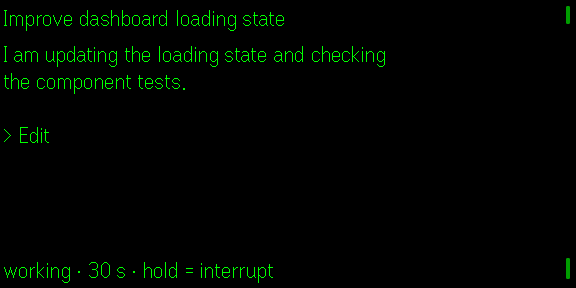

# Agent Glass

**Quietglass** · Watch and steer a coding agent without returning to your desk.

Agent Glass connects the Even G2 to Even Terminal, streams the active coding
session to the glasses, and surfaces permission requests where you can answer
them deliberately.



*Captured at the real 576 × 288 simulator resolution using the private,
offline `?demo=1` mode. No live terminal session or personal data is shown.*

## What it shows

The normal working view keeps only the newest part of the agent response and
the currently running tool:

```text
Improve dashboard loading state

I am updating the loading state and
checking the component tests.

> Edit

working · 12 s · hold = interrupt
```

When the agent requests permission, that decision takes over the display:

```text
Permission required

Bash

npm run build

up = allow · down = deny
```

Neither answer uses a plain tap, so an accidental touch cannot approve a
command.

## Important limitation

Even Terminal can read existing Claude Code sessions from disk, but it can
only control sessions that it started itself. Agent Glass checks this for each
session and labels external sessions as `watch only`; it never offers controls
that would silently fail.

Free-text questions must still be answered on the computer. Binary permission
requests can be allowed or denied from the glasses.

## Controls

| Gesture | Action |
|---|---|
| **Swipe up** | Allow a tool request in a controllable session |
| **Swipe down** | Deny a tool request |
| **Hold** | Interrupt a running agent, otherwise open the session list |
| **Swipe** in session list | Select a session |
| **Tap** | Open a session or retry after an error |
| **Double tap** | Exit Agent Glass |

## Setup

Start Even Terminal with CORS enabled. Keep it on a private network such as
Tailscale or your local LAN.

```bash
even-terminal start --tailscale --allow-cors
```

Paste the full pairing address printed by Even Terminal into the Agent Glass
phone view. The app extracts the server address and token automatically.

`even-terminal claude` is a client, not the server. All HTTP endpoints live
under `/api`, and `--allow-cors` is required because the app and terminal use
different origins.

## Develop and test

```bash
npm install
npm run dev
npm test
npm run build
npm run pack
```

Open `http://127.0.0.1:5202/?demo=1` for an isolated, in-memory demo. Demo
mode does not read stored sessions, connect to Even Terminal, or expose a
token. Use this mode for screenshots and documentation.

For a development-only live connection, a pairing URL may be passed as a
URL-encoded `pair` parameter. Never use that form in screenshots or public
documentation because URLs can be recorded by browser and proxy logs.

## Privacy and security

The Even Terminal token is a powerful credential. Agent Glass never logs it,
never displays it in full, and never renders it on the glasses. Do not expose
Even Terminal through a public tunnel unless you understand and accept the
risk.

The app has no analytics or telemetry. Live session text is rendered in memory
and is not added to this repository.

## Status

Agent Glass is a proof of concept built against Even Hub SDK 0.0.16 and tested
in the simulator. Hardware behaviour and the complete permission flow still
need validation on a physical Even G2.

## License

MIT
