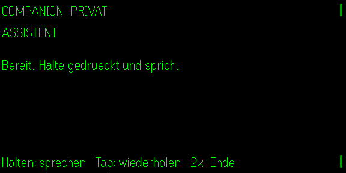

# Companion

**Quietglass** · Ein lokaler Sprachassistent mit einer klaren Aufnahmetaste.



Die Community wünscht sich einen Assistenten, der „ständig zuhört und das Leben versteht“. Companion setzt die nützliche Hälfte davon um, ohne eine permanente Überwachungsmaschine zu bauen: Long-Press öffnet das Mikrofon, Loslassen sendet genau diese Aufnahme an eine lokale Bridge, anschließend erscheint die Antwort auf der Brille.

## Start

```bash
node examples/assistant-bridge.mjs
npm install
npm test
npm run build
npm run dev
npm run sim
```

Die Adresse der lokalen Bridge kann in der Phone-UI gespeichert werden. Optional leitet sie Audio an `ASSISTANT_URL` weiter; `ASSISTANT_TOKEN` wird nur serverseitig verwendet. Die gewählte Sprache – Deutsch, Englisch, Französisch, Spanisch oder Italienisch – wird an den eigenen Assistenten weitergegeben. Ohne Ziel läuft ein klar gekennzeichneter Demo-Modus. Noch nicht auf echter G2-Hardware geprüft.
