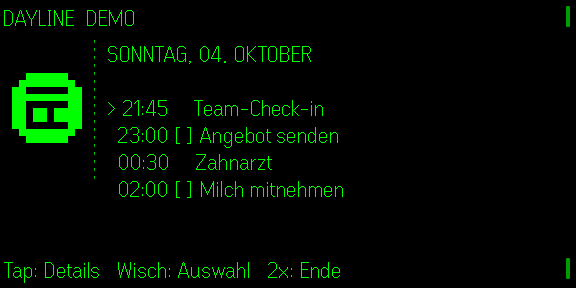

# Dayline

**Quietglass** · Kalender und Erinnerungen in einer Tageslinie.

Ein monochromes Pixel-Kalenderblatt macht die Tagesansicht auf der Brille sofort erkennbar.



Dayline kombiniert Termine und Aufgaben, ohne einen Cloudanbieter vorzuschreiben. Eine `.ics`-Datei kann direkt auf dem Telefon ausgewählt oder in die Phone-UI eingefügt werden; dafür ist kein Server nötig. Für laufende Synchronisierung liegt zusätzlich eine kleine lokale JSON-Bridge bei. Die Oberfläche und die Brillensteuerung unterstützen Deutsch, Englisch, Französisch, Spanisch und Italienisch.

## Start

```bash
npm install
node examples/dayline-bridge.mjs
npm test
npm run build
npm run dev
npm run sim
```

## ICS-Import

- Gezeigt wird der Zeitraum **ab heute 00:00 bis 30 Tage voraus**. Frühere Termine von heute bleiben sichtbar, damit der Tag vollständig lesbar ist; ältere Einträge eines exportierten Kalenders fallen weg. Termine, die gestern begonnen haben und noch laufen, bleiben ebenfalls.
- Wiederkehrende Termine (`RRULE`) werden innerhalb dieses Fensters aufgelöst: `FREQ=DAILY/WEEKLY/MONTHLY/YEARLY` mit `INTERVAL`, `COUNT`, `UNTIL`, `BYDAY` (wöchentlich, täglich als Filter, monatlich auch `2TU`/`-1FR`), `BYMONTHDAY`, `BYMONTH`, `WKST`, dazu `EXDATE` und verschobene Einzeltermine (`RECURRENCE-ID`). Abgesagte Termine (`STATUS:CANCELLED`) entfallen. Nicht unterstützte Regeln (z. B. `BYSETPOS`, `HOURLY`) erscheinen nur mit ihrem ersten Datum.
- `TZID` wird über `Intl` als IANA-Zone umgerechnet (auch Mozilla-IDs wie `/mozilla.org/…/Europe/Vienna`). Unbekannte Zonen, etwa Windows-Namen wie `W. Europe Standard Time`, werden als Gerätezeit gelesen.
- Termine an anderen Tagen zeigen ihr Datum vor der Uhrzeit. Eine Datei ohne Termine im Fenster ersetzt die Anzeige nicht, sondern meldet das auf dem Telefon.

Die G2 stellt selbst **keine Kalender-, Erinnerungs- oder allgemeine iOS-API** bereit. Dayline umgeht das nicht heimlich, sondern macht die Integrationsgrenze explizit. Noch nicht auf echter Hardware geprüft.
