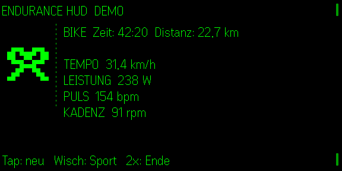

# Endurance HUD

**Quietglass** · Live-Lauf- und Raddaten für die Even Realities G2.

Je nach Sport erscheint ein eigenes monochromes Lauf- oder Fahrrad-Pixelpiktogramm neben den Live-Werten.

Endurance HUD zeigt Tempo oder Pace, Leistung, Herzfrequenz, Kadenz, Distanz und Trainingszeit. Die lokale Bridge nimmt schlankes JSON von Garmin Connect IQ, einem Cloudflare Worker, Radcomputer oder eigenen Sensor-Gateway entgegen.



## Start

```bash
npm install
node examples/telemetry-bridge.mjs
npm test
npm run build
npm run dev
npm run sim
```

Live-Daten senden:

```bash
curl -X POST http://127.0.0.1:8792/live -H "Content-Type: application/json" -d '{"sport":"bike","speedKph":32.1,"powerWatts":245,"heartRate":151,"cadence":92,"distanceKm":18.4,"elapsedSeconds":2200,"source":"garmin"}'
```

Optional schützt `ENDURANCE_TOKEN` den POST-Endpunkt. Deutsch, Englisch, Französisch, Spanisch und Italienisch werden unterstützt. Die App ist kein Medizinprodukt und noch nicht auf echter G2-Hardware geprüft.
