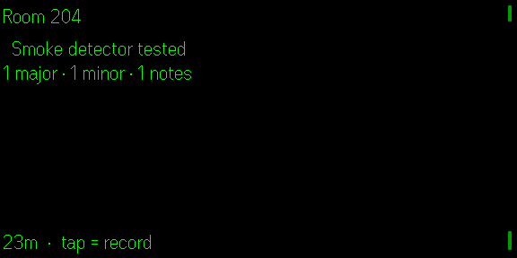

# FieldLog

**Quietglass** · Walk an inspection hands-free. Note the defect, attach a photo, export the report.

> **Auf Deutsch, kurz:** FieldLog ist dein Notizblock für Rundgänge – Wohnungsübergabe,
> Auto-Rückgabe, Kontrolle auf der Baustelle. Notizen wählst du mit Tippen und Wischen
> an der Brille, Fotos macht das Handy. Am Ende exportierst du einen Bericht. Kein
> Server, kein Konto, kein Internet nötig. Deutsch oder Englisch, je nach Handy-Sprache.
>
> **In 3 Schritten loslegen**
> 1. FieldLog installieren und auf der Brille öffnen.
> 2. Tipp an die Brille – ein Rundgang startet (mit Datum als Name).
> 3. Nochmal tippen, mit Wischen eine Schnellnotiz wählen („Beschädigt“, „Fehlt“ …),
>    tippen zum Speichern. Halten macht ein Foto. Am Handy kannst du Notizen auch
>    eintippen, Bereiche setzen und den Bericht exportieren.
>
> **Tabelle (CSV):** Neben dem CSV-Knopf wählst du das Format. „Für Excel (DE/AT)“
> (Standard bei deutscher App-Sprache) öffnet sich per Doppelklick richtig im deutschen
> Excel: Strichpunkt, Umlaute korrekt, Zeit wie `07.10.2026 14:05`, genaue Zeit (ISO, UTC)
> in der letzten Spalte. „Standard-CSV“ nimmt Kommas und ISO-Zeit für andere Programme.
>
> **Erweitert (optional):** Notizen *sprechen* statt wählen geht nur mit einem eigenen
> Whisper-Sprachserver in deinem Netzwerk – einzurichten am Handy unter „Erweitert“.
> Für alles andere brauchst du ihn nicht.

Use `?demo=1` on the development URL to render a non-persistent sample inspection for screenshots and layout testing.

Handover, survey, snag list, vehicle return, plant maintenance. You see
something, both hands are busy or dirty, and writing it down means stopping.
FieldLog lets you say it and carry on.

---



*Captured from the Even Hub simulator at the real 576 × 288.*

## The walk

Works out of the box, with no server:

1. **Tap** — with nothing open, an inspection starts, named after the date and time.
2. **Tap** — the quick-note list opens (*OK, Damaged, Missing, Dirty, Not working,
   Check later, See photo* — edit the list on the phone). **Swipe** to choose,
   **tap** to save. The last row is *Cancel*.
3. **Hold** to attach a photo from the phone camera. With no entry yet, the
   photo becomes an entry of its own.
4. On the phone you can also **type** a note, set the area, and export.

With a speech server set up (Advanced, optional), tap dictates instead:
**tap** to speak, **tap** to stop, **tap** to keep the transcript or **swipe**
to discard it.

Severity (`note` · `minor` · `major`) is set with a swipe and applies to the
next entry. Sections — Kitchen, Axle, Roof — are set on the phone and every
entry inherits the current one, so the report groups itself.

## Every transcript is confirmed

Speech recognition is imperfect, and an inspection report is a document someone
acts on: a wrong entry can become a wrong invoice or a missed fault.

So FieldLog never files a transcript silently. It shows what it heard and waits.
Keeping is one tap; discarding is one swipe. This is the one place in the app
that costs an extra gesture, and it is the right place for it.

## Your own recogniser (optional, advanced)

Dictation is optional. Audio is streamed to a speech server **you** configure —
the same wire format as Babel Glass, so one `faster-whisper` instance serves
both. Leave it empty (the default) and FieldLog uses quick notes; the microphone
is never opened. If the server cannot be reached, the glasses say so and point
to the address under *Advanced* on the phone. The labelled `MOCK` recogniser is
only used by the `?demo=1` preview.

## Photos

The glasses have no camera. FieldLog uses the SDK's phone-camera picker, which
is user-initiated by design — holding the temple pad opens the camera on your
phone, and the photo attaches to the entry you just made.

## Export

| Format | Contains |
|---|---|
| **Markdown** | Grouped by section, majors in bold, photos referenced by size |
| **Markdown + photos** | The same with images embedded — self-contained but large |
| **CSV** | One row per entry, for a spreadsheet |

Exports follow the app language (German or English); header and the
type/photo columns are translated (`Zeit,Abschnitt,Art,Text,Foto` with
`Notiz/Mangel/Wichtig` and `ja/nein`). The CSV comes in two formats, picked next
to the CSV button and remembered:

- **For Excel (DE/AT)** — the default when the app is in German. Opens correctly
  by double-click in German or Austrian Excel: `;` separator, CRLF, UTF-8 with
  BOM (so umlauts show), time in local time as `07.10.2026 14:05`, plus the
  exact time as ISO 8601 UTC in an extra last column.
- **Standard CSV** — the default in English. Comma-separated, UTF-8 without BOM,
  RFC 4180 quoting, time as ISO 8601 in UTC — for scripts and other programs.

There are no decimal numbers in it. In both, text that starts with `=`, `+`,
`-` or `@` gets a leading `'` so a spreadsheet does not run it as a formula.

Photos are referenced rather than embedded by default: a report with a dozen
inline base64 images is neither readable nor emailable.

## Example output

```markdown
# Handover flat 3

Started: 25 Sept 2026, 11:14
Major: 1 · Minor: 2 · Notes: 0

## Kitchen

- [09:16] *minor* — Tap drips at the base
  (photo attached, 412 kB)

## Bathroom

- [09:24] **MAJOR** — Mould behind the sink, spreading to the wall
```

## Controls

| Gesture | Effect |
|---|---|
| **Tap** | Start an inspection · open quick notes · save the highlighted note (with a server: dictate · stop · keep) |
| **Swipe** | Change the type of the next entry · move in the quick-note list · discard a transcript |
| **Hold** | Attach a photo from the phone camera |
| **Double tap** | Leave — stops the microphone |

## Language

German and English, following the phone's language (English otherwise), with a
picker on the phone page. Every glasses string is tested to fit one
46-character row in both languages.

## Install

```bash
npm install
npm run dev        # phone UI + app on http://127.0.0.1:5198
npm run build      # typecheck + production bundle
npm test           # 104 unit tests
npm run sim        # Even Hub simulator pointed at the dev server
```

For a speech server, use the reference implementation from Babel Glass
(`apps/babel-glass/examples/whisper-server.py`) — the wire format is identical.

## Privacy

- Without a speech server (the default) the microphone is **never** opened.
- With one, the microphone opens **only on an explicit tap**, with `● MIC`
  shown for as long as it is open.
- Audio goes **only to the server you configure**, and is **never stored**.
- Entries and photos stay in this app's storage on your phone until you export
  them. There is no upload and no account.
- Tokens are never logged and never shown in full.

Inspecting someone's property and photographing it carries obligations that are
yours, not the app's. FieldLog keeps everything local so that what you record
stays under your control.

## Known limitations

| Limitation | Detail |
|---|---|
| Photos live in per-app storage | Not a filesystem. The phone app shows the stored size and warns past ~4 MB; export and remove old inspections. |
| No editing text on the glasses | Correcting wording happens on the phone. |
| One inspection open at a time | Deliberate — mixing two walks is how entries end up in the wrong report. |
| Not verified on hardware | Built and tested against SDK 0.0.16; the simulator provides no meaningful speech and no camera. |

## Roadmap

- Location stamping per entry, using the SDK's `getAppLocation`.
- PDF export with photo plates.
- Re-usable inspection templates with predefined sections.

## Privacy

What data goes where, what is stored and how to delete it: [docs/PRIVACY.md](docs/PRIVACY.md).

## License

MIT — see [LICENSE](LICENSE).
