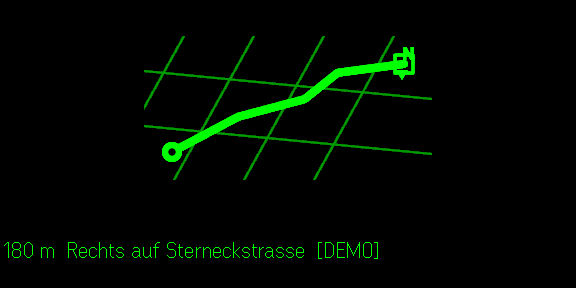

# Map Glass

**Quietglass** · Eine tatsächlich sichtbare, reduzierte Karte für die Even Realities G2.



Map Glass rendert eine kontrastreiche Route als Bild: Straßennetz im Hintergrund, Route und Position hell, nächste Abbiegung als Text. Zielkoordinaten werden in der Phone-UI gespeichert. Die mitgelieferte Bridge berechnet sofort eine echte OSRM-Route; über `OSRM_URL` kann stattdessen ein eigener Server verwendet werden. Oberfläche und Fahrhinweise unterstützen Deutsch, Englisch, Französisch, Spanisch und Italienisch.

## Start

```bash
node examples/route-bridge.mjs
npm install
npm test
npm run build
npm run dev
npm run sim
```

Die App ist eine visuelle Ergänzung zu OpenGlance, kein Ersatz für Aufmerksamkeit im Straßenverkehr. Noch nicht auf echter G2-Hardware geprüft.
