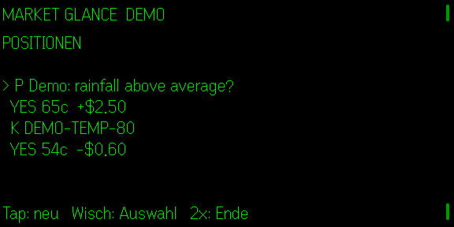

# Market Glance

**Quietglass** · Read-only Prediction-Market-Positionen für die Even Realities G2.

Market Glance zeigt offene Polymarket- und Kalshi-Positionen, Preis und P/L. Es gibt absichtlich keine Order-, Kauf- oder Verkaufsgeste. Polymarket nutzt nur eine öffentliche Wallet-Adresse. Kalshi-Anmeldedaten und Private Key bleiben in der lokalen Bridge und gelangen nie auf die Brille.



## Start

```powershell
$env:POLYMARKET_WALLET = "0x..."
# optional:
$env:KALSHI_KEY_ID = "..."
$env:KALSHI_PRIVATE_KEY_PATH = "C:\secure\kalshi-private-key.pem"
node examples/market-bridge.mjs
npm install
npm test
npm run build
npm run dev
npm run sim
```

Ohne Konfiguration läuft ein deutlich markierter Demo-Modus. Antwortet die Bridge nicht mehr oder sind die Daten älter als 45 s, zeigt die Brille `STALE 3m` statt `LIVE`; fällt nur ein Anbieter aus, liefert die Bridge die übrigen Positionen plus `errors` (Brille: `LIVE  P ERR`, Fehlertext auf der Handy-Seite). Kalshi-Preise sind das aktuelle Geld-Gebot der gehaltenen Seite (Fallback: letzter Handelspreis), P/L ist offen = Wert − Einstand; realisierter P/L steht separat auf der Handy-Seite. Unterstützt Deutsch, Englisch, Französisch, Spanisch und Italienisch. Nur Informationsanzeige, keine Finanzberatung. Noch nicht auf echter G2-Hardware geprüft.
