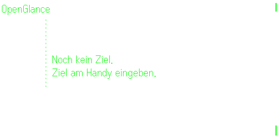
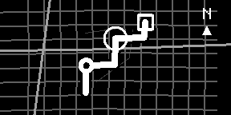

# OpenGlance Navigation

**Quietglass** · Turn-by-turn navigation on OpenStreetMap data. No Mapbox, no API key,
nothing to host.

## Works right after install

1. Open OpenGlance on the phone and **search for your destination** by name
   ("Mirabellplatz Salzburg"), then tap **Go here**.
2. Choose **On foot**, **Bike** or **Car**.
3. **Tap** the side of your glasses. That's it.

No account, no key, no server of your own. Routes come from the free public
OpenStreetMap routing server run by FOSSGIS e.V., place search from the free
public Photon server by komoot. The phone page and the glasses follow the
device language — **German and English** — and say what is wrong in plain
words: *"Kein GPS — geh ins Freie"*, *"Keine Verbindung"*, *"Kein Weg zum Ziel
gefunden"*.

Running your own servers is still one field away — see
[Advanced: your own servers](#advanced-your-own-servers).

The turn view is three things you can read in a glance:

```
┌────────┐ ┌──────────────────────────┐
│   ██   │ │ 250 m          (large)   │
│  ████  │ │ ■■■■■□□□  ← fills as the  │
│   ██   │ └──────────────────────────┘    turn comes closer
│   ██   │  Example Road
└────────┘
```

A large high-contrast **pixel arrow** that changes with every manoeuvre
(left, right, straight, U-turn, roundabout, arrival); the **distance to the
turn in large pixel digits** — the glasses' text has one fixed size, so this
is a small image; and below it an **approach bar** of eight blocks that fill
over the last 150 m on foot, 300 m by bike, 600 m by car (or over the whole
stretch if it is shorter, so a quick double turn starts empty). The road name
stays as text beside the arrow.

What crosses Bluetooth is kept small: the arrow image is sent only when the
manoeuvre changes, the distance card only when its digits or a bar block
change (and while it only counts down, at most every 2 s); the text changes
in place.

For a non-persistent demo route in the simulator, open the development URL
with `?demo=1`, or switch on **Advanced → Demo route** on the phone.

---



*Captured from the Even Hub simulator at the real 576 × 288.*

## Driving mode is the whole design

A navigation display in a car competes with the road. So in driving mode the
glasses show exactly three things: the pixel arrow, the distance to the turn
(large, with its approach bar), and the road name.

The approach bar belongs to the distance — it is the same number, made
readable from the corner of the eye — not a progress bar for the trip.
**No arrival time, no trip progress, no decoration** — there is a test
asserting the footer is empty in driving mode, so it cannot creep back in.

Walking and cycling add the remaining distance and arrival time, because
glancing at them on foot is safe. Walking is the default.

## Two views: next turn, or the whole route

**Swipe** on the glasses to switch between the turn arrow and an **overview
map** — the whole route as a thick white line with a black edge over the
**real streets around it**, your position (ringed dot), the next turn (ring),
the destination (square) and north. Three lines of turn text stay below the
map. The choice is remembered and can also be picked on the phone.




### What the map shows

The G2 converts images to 16 grey levels, so streets are drawn dimmer than
the route and by importance: **main roads** (motorway … secondary) brighter
and thicker, **side streets** (tertiary, residential, living streets,
pedestrian zones) dim, and **footpaths** faint and thin — footpaths only on
foot. Service roads, tracks, sidewalks and crossings are never drawn. How
much is shown follows the zoom: footpaths only when the picture covers at
most 2.5 km, side streets up to 4 km, main roads up to 25 km, nothing beyond
(a cross-country route is just the route). Lines are cut to the picture,
thinned to whole pixels and capped at 1 500 segments, main roads kept first.

### Where the streets come from, and what happens when they don't

Streets are OpenStreetMap data from the public **Overpass API**: one request
per route, made only after the overview has been on screen for 1.5 s (so a
swipe past it costs nothing), with only way geometry asked for and cut to
the area server-side. A reroute inside the area already loaded asks nothing.
The answer is held in memory, never stored. The overview image is sent when
the route, the streets or the next turn change — not per GPS fix: your
position marker moves only after it has moved 6 px and 5 s have passed.

If the street server is slow (12 s timeout), busy, offline, or answers with
something oversized (> 3 MB) or broken, the next server is tried once, then
OpenGlance pauses street requests for a minute and shows **the route alone**.
Navigation never waits for streets. **Advanced → Show real streets on the
overview map** switches them off; the demo route never fetches them.

The overview comes from Map Glass, which has been merged into OpenGlance. Its
projection keeps one scale for both axes (turns keep their real angles),
centres straight routes instead of pinning them to an edge, and keeps routes
across the antimeridian in one piece — those fixes and their tests came along.
Map Glass drew faint diagonal lines behind the route as texture; they looked
like streets and were not, so they are gone — real streets replaced them.

## Rerouting is automatic

A driver should not have to ask. Three consecutive fixes more than 40 m from
the route trigger a new one — at most once every 15 seconds, so someone
standing beside the route does not hammer a free public server. A tap reroutes
at once.

The count matters: a single noisy GPS fix must not throw away a valid route, so
one stray reading is ignored and the counter resets the moment you are back on
course. Both behaviours are pinned by tests.

## What it uses

| | |
|---|---|
| **Position** | `getAppLocation` / `onAppLocationChanged` from the phone, with a 5 m distance filter so a stationary phone does not drain itself |
| **Routing** | Valhalla `/route`, costing `auto` · `bicycle` · `pedestrian`; default `https://valhalla1.openstreetmap.de` (FOSSGIS e.V.) |
| **Place search** | Photon `/api/`; default `https://photon.komoot.io` (komoot) |
| **Geometry** | Encoded polyline at **precision 6** |

> The precision-6 detail is worth stating: Valhalla encodes at 6, while Google
> and OSRM use 5. Getting it wrong misplaces the entire route by a factor of
> ten with no error raised anywhere. There is a test asserting the ratio.

## Public servers, and keeping to their rules

Checked on 2026-10-06 by reading the terms and by calling the servers with an
`Origin` header:

| Server | Terms | WebView (CORS) | What OpenGlance does |
|---|---|---|---|
| `valhalla1.openstreetmap.de` (FOSSGIS e.V.) | [Nutzungsbedingungen](https://www.fossgis.de/arbeitsgruppen/osm-server/nutzungsbedingungen/): max. **1 request per second**; OSM attribution with a *fix the map* link; identifiable client; no high-traffic sites, commercial use only if not a substantial part of the offering; URL should not be hard-coded; no availability guarantee | `Access-Control-Allow-Origin: *`; preflight allows `Content-Type` and `X-Client-Id` | ≥ 1.1 s between requests (quick taps are queued, not dropped); automatic reroutes ≥ 15 s apart; never polls; sends `X-Client-Id: quietglass-openglance` because a WebView cannot set its User-Agent; attribution and fix-the-map link on the phone page; address editable under Advanced |
| `overpass-api.de` (FOSSGIS e.V., Overpass API) | [Overpass API wiki](https://wiki.openstreetmap.org/wiki/Overpass_API): fewer than 10 000 queries and 1 GB per day per user (divide by 100 for regular use); identify the app via User-Agent or Referer; after a 429 or 406 wait at least 30 s; no commercial use of the public instance | `Access-Control-Allow-Origin: *`. Returns **406** to a request with no `Referer`, or a bare default user agent (tested with curl); with a browser user agent plus `Referer` it answers 200. A WebView sends a `Referer` itself — whether the Even app's WebView does is **not verified on hardware**. Under load it answers **504** | one query per route, lazily, only after 1.5 s on the overview; reused for reroutes inside the loaded area; form POST (no preflight); 12 s timeout; on failure one try at `overpass.private.coffee` (no rate limit stated; it did not answer at all when tested), then a 60 s pause; switch under Advanced |
| `photon.komoot.io` (komoot) | [photon.komoot.io](https://photon.komoot.io/): free, "please be fair", heavy use is throttled | `Access-Control-Allow-Origin: *` | searches only on **Search** or Enter, never while typing; a repeated query is answered from memory; ≥ 1 s between searches; position bias rounded to about 1 km |

**Not used:** Nominatim. Its [usage policy](https://operations.osmfoundation.org/policies/nominatim/)
forbids client-side autocomplete, requires an identifying User-Agent (which a
WebView cannot set) and asks apps to proxy requests. The OSRM demo server
(`router.project-osrm.org`) also answers with CORS, but is for non-commercial
use at 1 request per second and does not give Valhalla's instructions and
street names, so it was not needed as a fallback.

The public Valhalla server caps walking routes at 100 km; OpenGlance then says
*"Too far for this way of travel"*.

### Attribution

The phone page shows, as both services' terms require:

> Map data © OpenStreetMap contributors (ODbL) · report a map error ·
> Routes: FOSSGIS e.V. · Valhalla · Search: Photon by komoot ·
> Overview streets: OpenStreetMap via Overpass API

With your own servers entered, the provider line names them instead.

## Progress is measured along the route

Advancing to the next manoeuvre is based on how far along the route you are,
not on how close you are to the turn. On a road that doubles back on itself,
proximity alone announces the wrong turn.

Positions are projected onto the route line, and both the distance to the next
manoeuvre and the distance remaining are measured along that line.

## Destinations

Search by address or place name; **Go here** saves the result and makes it the
destination in one step. Saved places stay on the phone for next time. **Save
my current position** remembers where you are (the car, the hotel).
Coordinates can still be typed under *Enter coordinates instead*.

## Advanced: your own servers

Everything a beginner never needs sits under **Advanced** on the phone page:
the routing server, the place-search server, the demo route, reversed swipe
direction and the language.

Any Valhalla instance works. Self-hosted, using a community image:

```bash
docker run -p 8002:8002 -v "$(pwd)/custom_files:/custom_files" \
  ghcr.io/gis-ops/docker-valhalla/valhalla:latest
```

Then enter `http://your-host:8002` as the routing server. No key, no account.
Your server must answer the WebView's CORS preflight
(`Access-Control-Allow-Origin`, `Content-Type` allowed); OpenGlance sends it no
extra headers.

Photon self-hosts the same way (see [komoot/photon](https://github.com/komoot/photon));
enter its base URL as the place-search server. Empty either field to return to
the public default.

The **demo route** is a fixed made-up route that exercises the whole pipeline
without any network; the glasses mark it `DEMO` so it can never be mistaken for
real navigation.

## Controls

| Gesture | Effect |
|---|---|
| **Tap** | Start navigating · retry after an error · reroute when off route |
| **Swipe** (either way) | Switch between next turn and overview map |
| **Hold** | Stop navigating |
| **Double tap** | Leave OpenGlance — the glasses ask to confirm; cancelling keeps navigating |

## Install

```bash
npm install
npm run dev        # phone UI + app on http://127.0.0.1:5199
npm run build      # typecheck + production bundle
npm test           # 216 unit tests
OPENGLANCE_PREVIEW=1 npx vitest run tests/overview-streets.test.ts tests/turncard.test.ts
                   # re-render docs/overview-preview.png and docs/turn-card-preview.png
npm run sim        # Even Hub simulator pointed at the dev server
```

## Privacy

Your position is used to route and **is never stored**. No position history is
written anywhere — where a person has been is among the most sensitive data a
device holds, and this app has no reason to keep it.

The overview map sends the area around the route, rounded to about 10 m,
once per route to the street server (Overpass), unless switched off.

Your position and destination go only to the routing server (the public
FOSSGIS one unless you enter your own) when a route is calculated. A place
search sends the words you typed and an area rounded to about a kilometre to
the search server. With the demo route, nothing leaves the device at all.

See [docs/PRIVACY.md](docs/PRIVACY.md).

## Known limitations

| Limitation | Detail |
|---|---|
| **Public servers, no guarantee** | FOSSGIS and komoot run them for free on single servers and may change terms or switch them off at any time. If OpenGlance became popular enough to matter to them, a self-hosted or sponsored server would be the right answer. |
| Overview streets are best effort | They depend on a free public server that is often overloaded (504) and may refuse a WebView that sends no `Referer` (406); then the overview shows the route alone. No street names, no buildings — the 288 × 144 picture cannot carry them. |
| Long walks | The public server caps walking routes at 100 km. |
| No lane guidance | Valhalla supplies some; it is not displayed yet. |
| No speed or speed limits | Not shown. |
| **Not verified on hardware** | Built and tested against SDK 0.0.16. The simulator supplies no GPS, so the position pipeline is covered by unit tests with synthetic fixes rather than by a real drive. |

**Do not rely on this as your only navigation.** It has not been road-tested.

## Roadmap

- Lane guidance where the router supplies it.
- Waypoints.
- Offline route caching for a planned trip.

## License

MIT — see [LICENSE](LICENSE).
