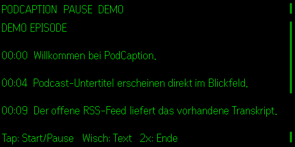

# PodCaption

**Quietglass** · Podcast-Untertitel für die Even Realities G2.



PodCaption kann WebVTT-, SRT-, JSON- oder Textdateien direkt vom Telefon öffnen. Optional liest die Bridge den offiziellen Podcasting-2.0-Tag `podcast:transcript` aus einem RSS-Feed; bietet eine Folge mehrere Transkripte an, nimmt sie zeitcodierte Formate (WebVTT, dann SRT, JSON) vor HTML oder reinem Text und versucht bei einem defekten Link das nächste. Die Wiedergabe folgt den Zeitstempeln; nur ungetakteter Text läuft im festen 4-Sekunden-Takt. Feed- und Transkriptfehler erscheinen auf dem Telefon und als eine Zeile auf der Brille. Damit bleibt die App unabhängig von Spotify. Oberfläche und Brillensteuerung unterstützen Deutsch, Englisch, Französisch, Spanisch und Italienisch; der eigentliche Untertiteltext bleibt in seiner Originalsprache.

## Start mit einem Feed

```powershell
$env:PODCAST_FEED_URL = "https://example.org/podcast.xml"
node examples/podcast-bridge.mjs
npm install
npm test
npm run build
npm run dev
npm run sim
```

Die Bridge akzeptiert ausschließlich Transkript-URLs, die im konfigurierten Feed vorkommen. Noch nicht auf echter G2-Hardware geprüft.
