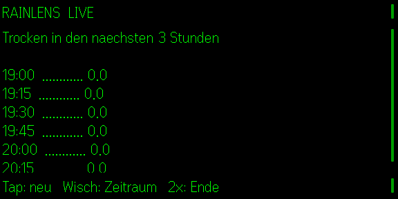

# RainLens

**Quietglass** · Niederschlag auf einen Blick für die Even Realities G2.

RainLens holt die nächsten drei Stunden als 15-Minuten-Niederschlagswerte von Open-Meteo und zeigt daraus eine ruhige, lesbare Radar-Zeitleiste. Die Darstellung ist absichtlich keine winzige bunte Wetterkarte: Auf 576 × 288 monochromen Pixeln beantwortet sie die wichtigere Frage schneller – **wann beginnt der Regen, wie stark wird er, wann hört er auf?**



## Funktionen

- Standort vom Telefon, Salzburg als gekennzeichneter Fallback
- zwölf 15-Minuten-Werte, davon sechs gleichzeitig auf der Brille
- kein Konto und für nicht-kommerzielle Nutzung kein API-Schlüssel
- Tap aktualisiert, Doppeltipp beendet
- Demo-Fallback bei Netzfehlern
- automatische Spracherkennung plus Umschalter für Deutsch, Englisch, Französisch, Spanisch und Italienisch
- alternativ zur Telefonposition frei speicherbare Koordinaten

## Entwicklung

```bash
npm install
npm test
npm run build
npm run dev
npm run sim
```

Noch nicht auf echter G2-Hardware geprüft. Open-Meteo liefert modellbasierte 15-Minuten-Niederschläge; RainLens behauptet deshalb nicht, ein meteorologisches Roh-Radarbild zu sein.
