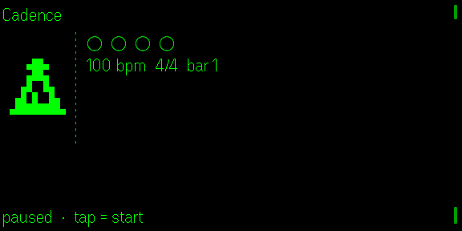
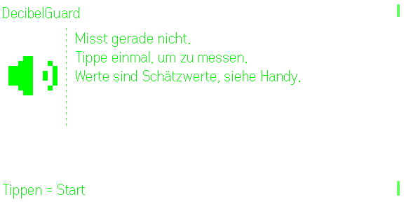
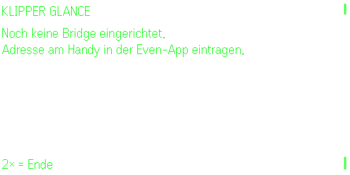
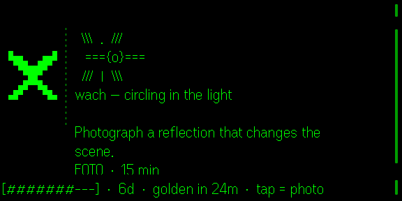
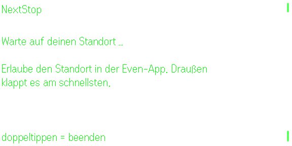
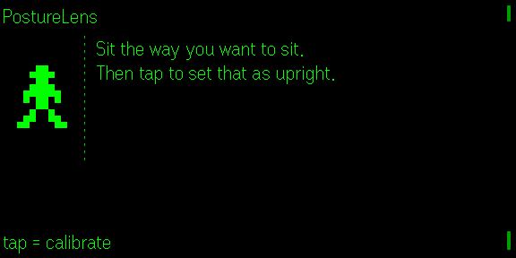
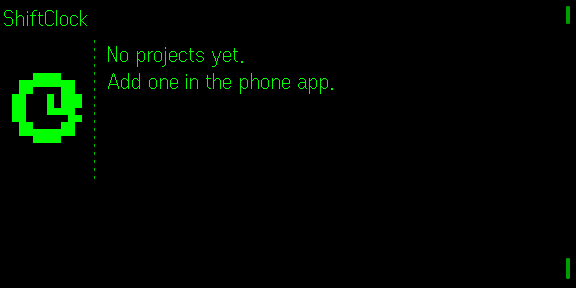
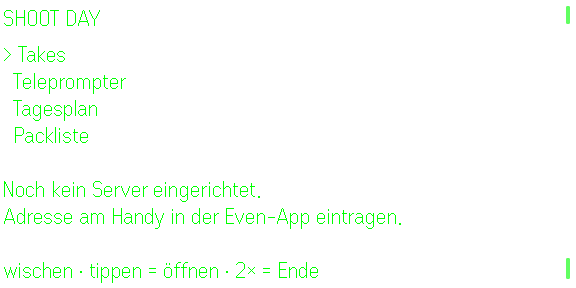
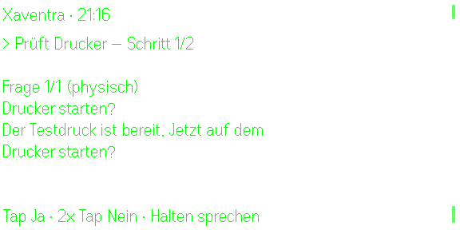
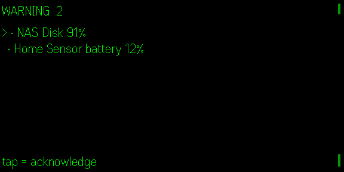

# Quietglass G2 screenshot gallery

Every image below is captured from the Even Hub simulator at the native 576 × 288 glasses resolution. Click an app name for its setup, controls, privacy notes, and install instructions.

| App | Simulator capture |
|---|---|
| [Agent Glass](../apps/agent-glass) |  |
| [Babel Glass](../apps/babel-glass) |  |
| [Cadence](../apps/cadence) |  |
| [DecibelGuard](../apps/decibel-guard) |  |
| [Endurance HUD](../apps/endurance-hud) |  |
| [FieldLog](../apps/field-log) |  |
| [FlowList](../apps/flowlist) |  |
| [Klipper Glance](../apps/klipper-glance) |  |
| [Lumen Glass](../apps/lumen-glass) |  |
| [Market Glance](../apps/market-glance) |  |
| [NextStop](../apps/nextstop) |  |
| [OpenGlance](../apps/openglance-nav) |  |
| [PodCaption](../apps/podcaption) |  |
| [PostureLens — private posture reminder](../apps/posture-lens) |  |
| [RainLens](../apps/rain-lens) |  |
| [ShiftClock](../apps/shift-clock) |  |
| [Shoot Day](../apps/shoot-day) |  |
| [Xaventra HUD](../apps/xaventra-hud) |  |
| [Status Glass + Home Assistant](../apps/status-glass#home-assistant) |  |

The screenshots demonstrate simulator behavior, not physical-G2 verification. Each app README states its current hardware-validation status.
